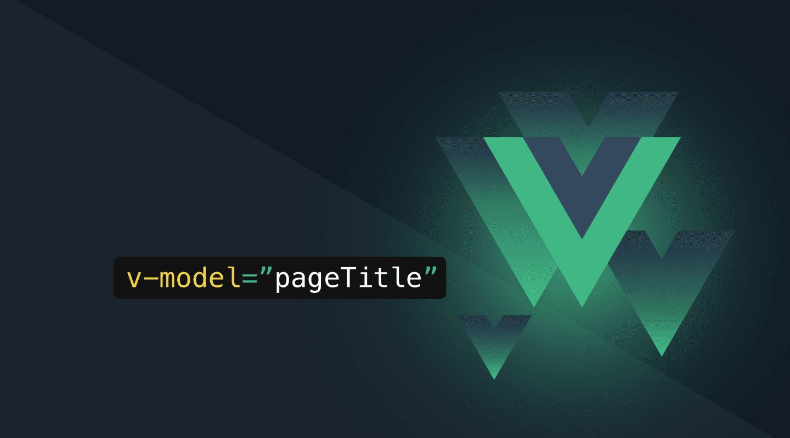

# Nuxt 3 Minimal Starter

Look at the [Nuxt 3 documentation](https://nuxt.com/docs/getting-started/introduction) to learn more.

## Setup

Make sure to install the dependencies:

```bash
# npm
npm install

# pnpm
pnpm install

# yarn
yarn install

# bun
bun install
```

## Development Server

Start the development server on `http://localhost:3000`:

```bash
# npm
npm run dev

# pnpm
pnpm run dev

# yarn
yarn dev

# bun
bun run dev
```

## Production

Build the application for production:

```bash
# npm
npm run build

# pnpm
pnpm run build

# yarn
yarn build

# bun
bun run build
```

Locally preview production build:

```bash
# npm
npm run preview

# pnpm
pnpm run preview

# yarn
yarn preview

# bun
bun run preview
```

### Vue.js 3 v-model two-way data binding for Dummies



Vue `v-model` is a directive that creates a two-way data binding between a value in our template and a value in our data properties, while `v-bind` only binds data one way. 

#### v-model directive explained
Vue's v-model directive does the following under the hood:

```js
<MyChild v-model="someRef" />

<MyChild
    :modelValue="someRef"
    @update:modelValue="someRef = $event"
/>

```

By default, the following applies to `v-model`:
- default prop name is `modelValue`
- default event is `update:modelValue`

This prop and event name will then be available in your child component.

### CustomInput form component

In this example, we are building a `CustomInput` form component that wraps the native `<input>` HTML element. It could then be used like this from our parent component:

```js
<script setup>
import { ref } from 'vue'
import CustomInput from './CustomInput.vue'

const fullname = ref('')
</script>

<template>
    <form>
        <CustomInput v-model="fullname" />
    </form>
</template>
```

Our child component (basic `CustomInput` form component) looks like this:

```js
//  CustomInput.vue
<script setup>
defineProps(['modelValue'])
defineEmits(['update:modelValue'])
</script>

<template>
    <input
        :value="modelValue"
        @input="$emit('update:modelValue', $event.target.value)"
    />
</template>
```

In this example, the data we are binding to our event is `$event.target.value` which is the actual String value of this `input` field.

> Remember: Native HTML elements always fire `Events`, so you'll never get a primitive (like e.g. a Boolean or a String) as `$event`. That's why you need to retrieve the effective input element's value with `$event.target.value` in this case.

### CustomSwitch (Toggle) form component

So our fully working (and minimally styled) CustomSwitch component looks like this:

```js
 // CustomSwitch.vue 
<script setup>
import { Switch } from '@headlessui/vue'

defineProps({
    modelValue: {
        type: Boolean,
        default: false,
    },
    label: {
        type: String,
        default: '',
    },
})

defineEmits(['update:modelValue'])
</script>

<template>
    <Switch
        :class="modelValue ? 'bg-primary-600' : 'bg-gray-300'"
        class="relative inline-flex h-6 w-11 items-center rounded-full"
        :modelValue="modelValue"
        @update:modelValue="(newValue) => $emit('update:modelValue', newValue)"
    >
        <span class="sr-only">{{ label }}</span>
        <span
            :class="modelValue ? 'translate-x-5' : 'translate-x-0'"
            class="inline-block h-5 w-5 transform rounded-full bg-white"
        />
    </Switch>
</template>
```

Full code: Creating a custom reusable switch button in Nuxt 3 involves creating a Vue component that can be used throughout your application. This component should be configurable, allowing for various styles and behaviors depending on its usage. 

```js
<template>
    <button
      :class="['switch-button', { 'switch-button--on': isOn }]"
      @click="toggleSwitch"
    >
      <span :class="['switch-button__slider', { 'switch-button__slider--on': isOn }]" />
    </button>
  </template>
  
  <script setup>
  import { ref, defineProps, defineEmits, watch } from 'vue'
  
  const props = defineProps({
    modelValue: Boolean,
    label: String,
    disabled: Boolean
  })
  
  const emit = defineEmits(['update:modelValue'])
  
  const isOn = ref(props.modelValue)
  
  const toggleSwitch = () => {
    if (!props.disabled) {
      isOn.value = !isOn.value
      emit('update:modelValue', isOn.value)
    }
  }
  
  watch(() => props.modelValue, (newValue) => {
    isOn.value = newValue
  })
  </script>
  
  <style scoped>
  .switch-button {
    display: inline-flex;
    align-items: center;
    cursor: pointer;
    background-color: #ccc;
    border: none;
    border-radius: 20px;
    padding: 10px;
    position: relative;
    width: 60px;
    height: 30px;
    transition: background-color 0.3s;
    border: 1px solid;
  }
  .switch-button--on {
    background-color: #4caf50;
  }
  .switch-button__slider {
    display: block;
    width: 28px;
    height: 28px;
    background-color: white;
    border-radius: 50%;
    position: absolute;
    top: 0px;
    left:0;
    transition: transform 0.3s;
  }
  .switch-button__slider--on {
    transform: translateX(30px);
  }
  </style>
  ```