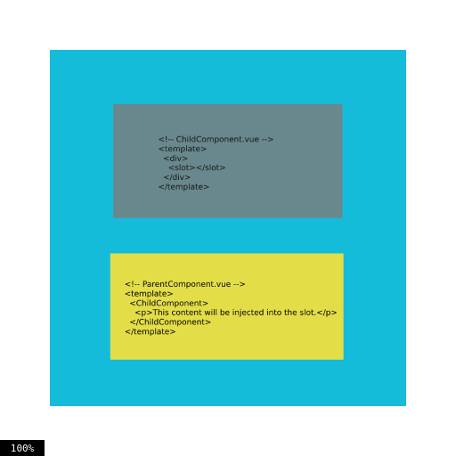

# Understanding Slots in Vue 3

Slots provide a mechanism for creating component templates that can receive content from the parent component. 

With slots, you can define placeholders in your component's template where the parent component can inject its content. 

## Default Slots


The default slot, also known as the unnamed slot, is the simplest type of slot. It allows the parent component to pass content directly into the component's template.

 Here's an example:

 ```js
//<!-- ChildComponent.vue -->
<template>
  <div>
    <slot></slot>
  </div>
</template>

// <!-- ParentComponent.vue -->
<template>
  <ChildComponent>
    <p>This content will be injected into the slot.</p> 
  </ChildComponent>
</template>
 ```
 